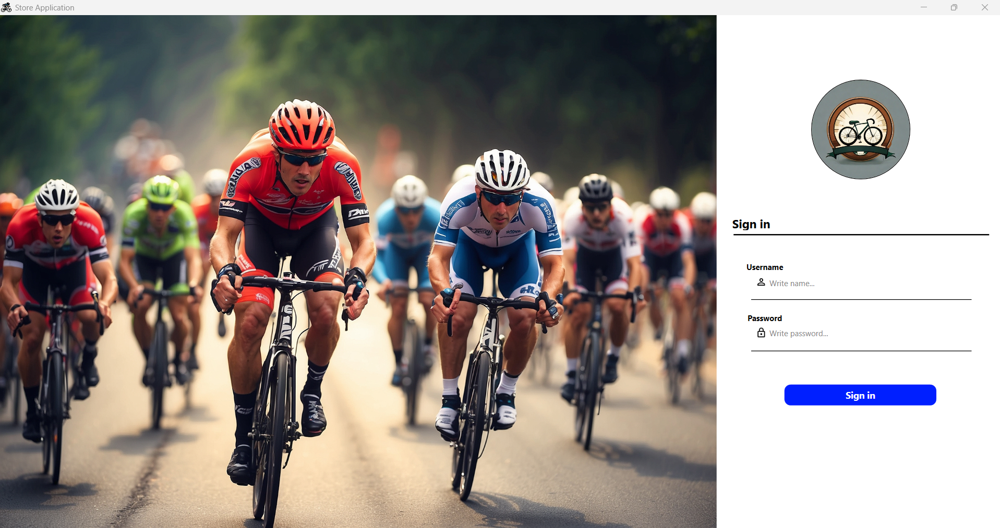
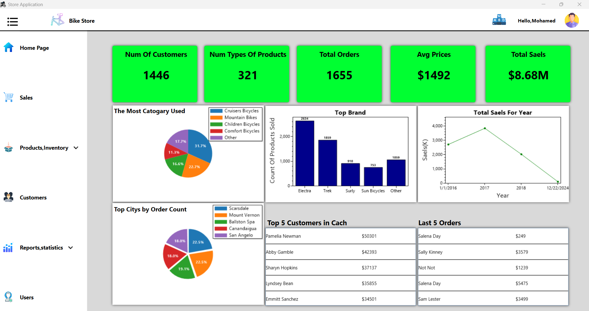
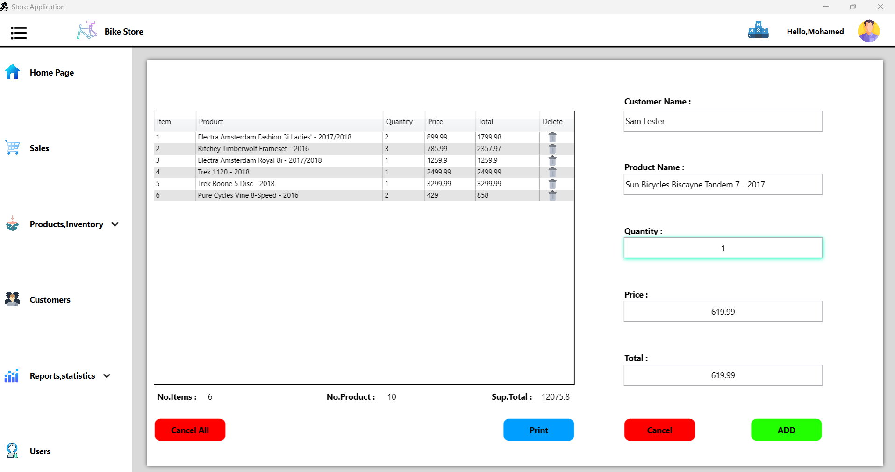
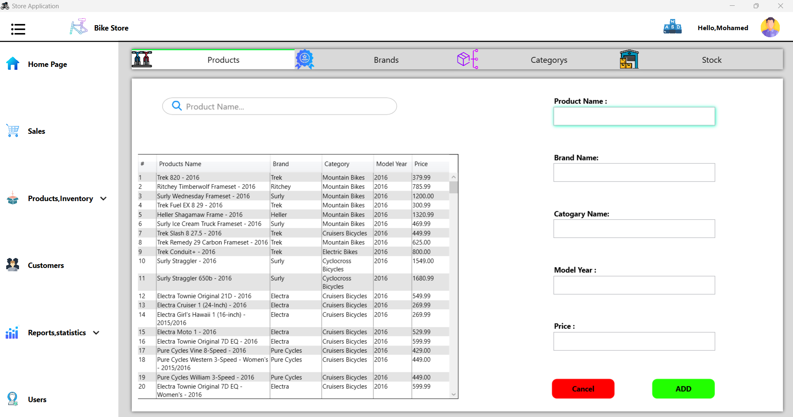
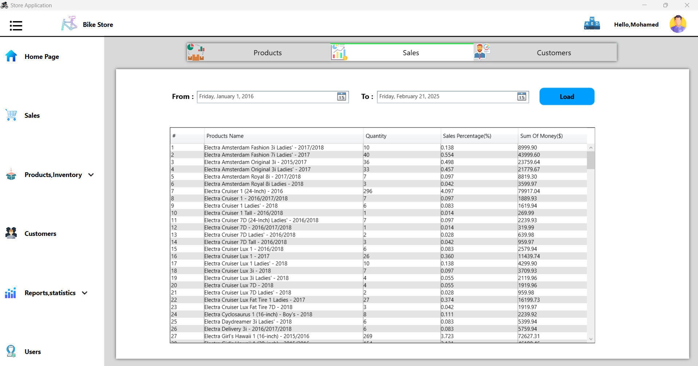

# Sales & Inventory Management System

## 🔍 Project Overview
This comprehensive **Sales & Inventory Management System** was designed and developed to streamline sales tracking, inventory management, and reporting. The system offers a user-friendly interface, dynamic data visualization, and robust backend logic for efficient business operations.

## 🛠️ Technologies Used
- **.NET Framework**  
- **C#**  
- **Microsoft SQL Server**  
- **XAML**

## 🚀 Key Features
- **Robust Backend Architecture**  
  Efficient handling of business logic and data management with C# and SQL Server.

- **Optimized UI/UX**  
  Overcame XAML’s design limitations by integrating dynamic, backend-driven UI components for a seamless user experience.

## 📊 Main Interfaces (7 Pages)
1. **🔐 Login Page**  
   Allows authorized users to access the application by signing in.

2. **🏠 Home Page**  
   Displays key statistics such as:
   - Top-selling brands  
   - Sales performance over the years  
   - Most-used categories  
   - And much more  

3. **💰 Sales Page**  
   A flexible sales registration system designed to prevent errors and ensure smooth transactions.

4. **📦 Product & Inventory Page**  
   Manage products and inventory efficiently with features for stock tracking, product details, and updates.

5. **👥 Customer Page**  
   Register and manage customer information for sales tracking.

6. **📑 Reports Page**  
   Provides detailed reports and analytics on products, sales, and customer data.

7. **👤 User Management Page**  
   Add users to grant access to the application.

## 📖 Usage  
For details on how to use the system, please refer to **[USAGE.md](USAGE.md)**.  

## 📸 Project Images

### 🔐 Login Page  

### 🏠 Home Page  

### 💰 Sales Page  

### 📦 Product & Inventory Page  

### 👥 Customer Page  

### 📑 Reports Page  

### 👤 User Management Page  

